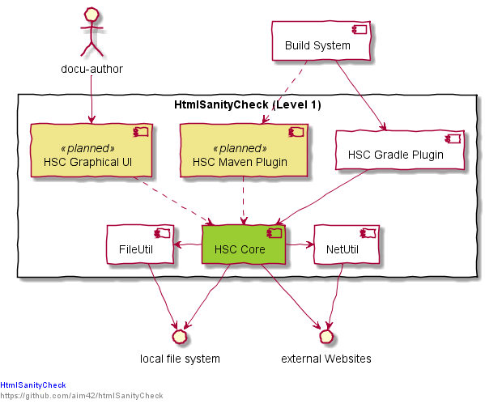

== How to get the plantUML source from a generated image

PlantUML stores by default the source for a diagram in the meta data of the generated `.png` or `.svg` file.

This can easily be retrieved through the command line:

    java -jar plantuml.jar -metadata whitebox-hsc.level-1.png

This turns

back to

[source, plantuml]
----
include::whitebox-hsc-level-1.meta[]
----

IMPORTANT: plantUML also has the option `-nometadata` => it could be that your diagrams do not contain the metadata...

[plantuml, "{plantUMLDir}whitebox", png]
----
include::Diagram.puml[]
----
